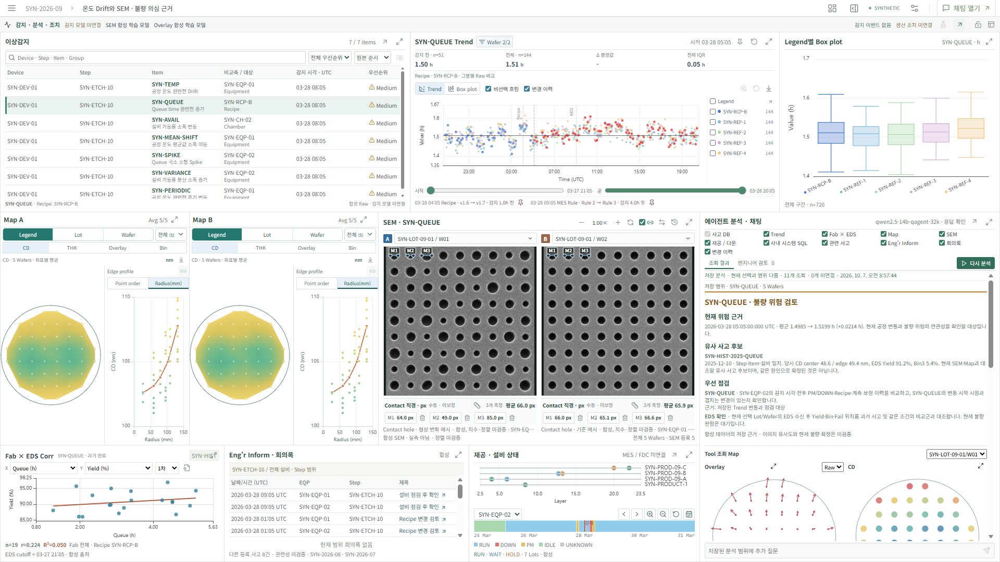

# Q-Agent

**반도체 품질 이상을 조사하고, 관련 사고와 근거를 연결해 점검 방향을 제안하는 분석 Agent입니다.**
사고 DB·생산 SQL·회의록/RAG·Trend·SEM·Wafer Map을 함께 검토하고, 엔지니어가 같은 대화방에서 추가 질문하며 분석을 이어갑니다.



[Map 근거 화면](q-agent-map-evidence.png) · [SEM 비교 화면](q-agent-sem-comparison.png)

> 공개 데모는 합성 DB·Map과 AI 생성 SEM을 사용합니다. 실제 사내 데이터, 불량 확정 또는 생산 조치 완료를 뜻하지 않습니다.

## 분석 흐름

| 단계 | 역할 |
|---|---|
| **Router** | 질문과 현재 조사 조건을 바탕으로 Tool 조회 계획 작성 |
| **사고 DB** | 관련 사고 검색, 사고·Lot·Wafer 조회 범위 검증 |
| **후속 Tool** | 생산 SQL, 문서 RAG, Trend·이미지·Map 근거 조회 |
| **Judge** | 근거의 충분성·범위·비교 가능 여부 검토 |
| **Answer** | 관측 내용, 유사 사고, 점검 제안과 미확인 사항 설명 |

| 실행 규칙 | 처리 |
|---|---|
| 근거 부족 | Judge → 같은 Router로 재조회 요청; 예산 소진 시 부분 답변 |
| 독립 문서 질문 | 사고 분석이 아닌 경우 사고 DB 조회 생략 가능 |
| 후속 질문 | 대화 기록과 조사 조건을 참고하되, 이전 답변을 조회 근거로 취급하지 않음 |

사고 범위와 Tool 입력은 코드에서 검증합니다. 화면에서는 저장 분석을 바로 확인하고, 재분석·추가 질문을 명시적으로 실행합니다.

## 프롬프트와 Skill

Router·Judge·Answer는 **각각 별도 시스템 프롬프트**를 조립합니다.

```text
공통 규칙 + 필요한 업무·컬럼 설명 + 역할 지침·출력 계약
                               ↓
                     Router / Judge / Answer
```

[app/skills](app/skills)의 공통·Schema·역할 Skill을 필요한 부분만 수정하고, 검토 후 버전을 freeze합니다. 온라인 대화로 원본 Skill을 자동 변경하지 않습니다. **프롬프트 개선과 모델 가중치 학습은 별개**입니다.

## 모델 학습과 고도화

**이미지 데모 학습은 구현되어 있으며, sLLM SFT·RLHF는 다음 단계 설계입니다.**
요청의 “HFRL”은 여기서는 사람 피드백 기반 강화학습인 **RLHF** 의미로 해석합니다.

| 대상 | 어떻게 학습하는가 | 현재 상태 |
|---|---|---|
| **이미지 모델** | 합성 SEM의 정상·bridge·gap, Overlay의 정상·이동·방사형 패턴에서 특징을 추출해 Logistic Regression 학습 | CPU 데모 구현. 화면의 AI 생성 SEM은 학습에 사용하지 않음 |
| **sLLM SFT** | 전문가 회의록에서 질문·근거·답변을 만들고, 검토된 Tool 호출과 Judge 판정을 역할별 학습 예제로 구성. LoRA/QLoRA 적용 계획 | 학습 파이프라인·가중치 미구현 |
| **선호 학습 / RLHF** | 엔지니어가 선택·기각한 답변 쌍으로 DPO를 우선 검토. 별도 보상 모델과 PPO를 사용하는 RLHF는 이후 필요성 검증 | 미구현. DPO와 RLHF를 동일한 학습 방식으로 취급하지 않음 |

```text
사고 DB · 전문가 회의록 · 이미지
                ↓
검토된 라벨 / 근거 포함 QA / 답변 선호쌍
                ↓
이미지 모델 학습 + sLLM SFT → 선호 최적화
                ↓
미사용 사고·기간으로 검증 → 전문가 승인 → 버전 배포
```

- 회의록은 전문가 해석 자료이지 자동 정답이 아닙니다. 원본 DB·이미지와 대조해 학습 예제를 승인합니다.
- 같은 사고·Lot이 학습과 검증에 섞이지 않도록 분리합니다. 최신 사실은 모델 암기 대신 SQL/RAG로 조회합니다.
- **핵심 근거 token recall**을 우선하되, 답변을 길게 써서 점수를 높이지 않도록 사실성·출처·범위 오류도 별도로 확인합니다.
- 실측 이미지 학습은 공정·패턴별 라벨, 촬영 조건과 좌표 정합을 확보한 뒤 진행합니다. 합성 데이터 점수를 실제 공정 성능으로 해석하지 않습니다.

이미지 데모 학습:

```bash
python app/train_demo_images.py --model-root var/models/demo-images --train-per-class 60 --holdout-per-class 30
```

서로 다른 seed의 학습·holdout 데이터, 모델과 측정 결과를 지정 폴더에 저장합니다.

## 실행

Python 3.11+, Node.js 22+에서 저장소 루트 기준으로 실행합니다.

```bash
python -m pip install -r requirements.txt
npm --prefix web ci
npm --prefix web run build
python app/workbench.py --port 8787
```

브라우저: **http://127.0.0.1:8787/**. 사용 중인 포트라면 다른 포트를 지정합니다.
기본 실행은 DB 조회 데모이며, 실제 LLM 분석에는 모델 endpoint와 `agent_overlay` 설정이 필요합니다.

| 수정할 항목 | 진입점 |
|---|---|
| Agent 실행·분석 흐름 | [app/run_agent.py](app/run_agent.py), [app/agent.py](app/agent.py) |
| DB·폴더·모델·테이블 매핑 | [config/config.yaml](config/config.yaml) + site overlay |
| UI 서버·원자료·대화 DB | [config/workbench.yaml](config/workbench.yaml) |
| 역할 프롬프트·업무 설명 | [app/skills](app/skills) |

[사내 실행 방법](docs/current/ONPREM_RUN.md) · [상세 설계](docs/current/PROJECT_DESIGN.md)

## 연결 범위

종합 분석용 더미 사례는 [scenarios.json](data/workbench/scenarios.json)에서 관리합니다. `sources.scenario_file`로 연결하면 7개 이상 유형의 Inform, 과거 사고이력과 정기 사고 분석회의를 함께 구성합니다. 새 데모는 현재 조사 9건·과거 사례 7건을 사고 DB에 저장하고, 초기 분석과 후속 회의록을 사고 ID로 연결합니다. 비사고 비교 사례와 원인 미확정 사례도 포함합니다.

사내 SQL Adapter와 Hybrid RAG 연결 설정을 제공하지만 **실제 사내 시스템 검증은 별도**입니다. 공개 데모의 LLM은 Tool이 조회한 Map의 수치 요약과 출처를 검토하며, 전체 이미지를 직접 이해하는 멀티모달 모델과는 구분합니다.

현재 EDS 결과, 이미지 물리 정합, 운영 인증·권한 및 생산 조치는 검증 완료가 아닙니다. 서버는 localhost 단일 사용자 데모로 사용하고, 비밀정보·사내 자료·로컬 설정·생성 모델은 Git에 올리지 않습니다.
