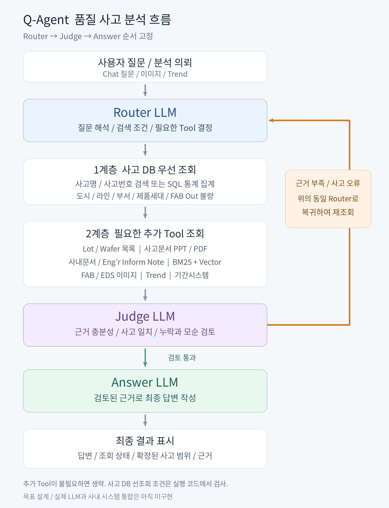

# Q-Agent 상세 요청 처리 설계

기준일: 2026-09-13. 사용자와 확정한 세로 순서는 Router LLM → Judge LLM → Answer LLM이다. Router는 상단에 하나만 표시한다. Judge 재조회는 그 Router로 복귀한다. 이 문서는 목표 설계이며 실제 구현 상태는 마지막 표를 기준으로 구분한다.

## 1. 사용자 질문에서 최종 결과까지



| 위에서 아래 순서 | 처리 내용 |
|---|---|
| 사용자 질문 / 이미지 / Trend 의뢰 | 원문, 첨부 자료, 사고명/번호, 도시, 라인, 기간, 대상 제품을 받는다. |
| ↓ | |
| **Router LLM** | 질문의 요구사항, 논리 검색 조건, 필요한 Tool과 Skill을 결정한다. |
| ↓ | |
| **1계층: 사고 DB 우선 조회** | 정형 사고 검색 또는 SQL 집계를 실행하고 사고 범위와 조회 상태를 기록한다. |
| ↓ | |
| **2계층: 필요한 추가 Tool 조회** | Lot/Wafer, 사고문서, 사내문서, Eng’r Inform Note, 이미지, Trend, 기간시스템을 필요한 만큼 조회한다. |
| ↓ | |
| **Judge LLM** | 원문 질문에 답할 근거가 충분한지, 사고 범위가 맞는지, 누락/모순이 있는지 검토한다. |
| ↓ | 검토 통과 후 진행한다. 근거 부족이나 사고 오류는 맨 위 Router로 돌린다. |
| **Answer LLM** | 검토된 근거로 최종 답변을 작성한다. 마지막 LLM이다. |
| ↓ | |
| **최종 결과 표시** | 답변, 조회 상태, 확정된 사고 범위, Lot/Wafer 목록, 문서 출처와 이미지, 미확인 항목을 표시한다. |

재조회 경로는 본 흐름의 LLM 순서를 바꾸지 않는다. 근거 부족일 때 맨 위 Router를 다시 호출하고, 갱신된 Tool 결과를 Judge가 다시 검토한다. 아래쪽에 Router를 새로 만들지 않는다. 시각 배치를 유지하기 위해 주 흐름은 세로 표로 표시하고 재조회 규칙은 별도 표로 설명한다.

사고 DB 선조회 조건은 Tool 실행 코드가 검사한다. 최종 결과의 '사고 범위 표시'와 실행 전 범위 검증은 서로 다른 작업이다. DB만으로 답할 수 있는 질문은 2계층 Tool을 실행하지 않고 Judge로 진행한다. 어떤 Tool을 생략했는지는 조사 상태에 남긴다.

## 2. Router LLM: 무엇을 찾아야 하는지 결정

입력은 원문 질문, 대화에서 선택된 사고, 현재 조사 상태, 실제 Tool 결과, Judge가 지적한 부족한 근거다. 최초 호출에서 사고 DB 검색/집계 계획만 실행 가능하도록 한다. DB 조회 후 필요한 후속 계획도 같은 Router에서 만든다.

| 결정 항목 | 예시 또는 규칙 |
|---|---|
| 질문 의도 | 사고 검색, 통계, Lot 목록, Wafer 목록, 원인/개선 근거, 이미지/Trend 분석, 조치 요청 |
| 논리 필터 | 도시, 라인, 사고번호/명, 부서, 기간, 제품세대, FAB Out 불량 코드 |
| 필수 답변 항목 | '원인 + 조치 + Lot + Wafer'처럼 요구사항을 분해하고 각각 근거 확보 상태를 추적한다. |
| 현재 조회 범위 | 선택 사고 ID, 필터, 기준시점, 권한 범위, 유효기간 |
| 다음 Tool | 미확보 근거를 채울 Tool과 조회 조건, 선행 Tool 의존성 |
| 확인 질문 | 동명 사고 후보가 여럿이거나 부서/기간이 불명확할 때 필요한 정보 |

현재 Router 출력 계약은 `intents`, `filters`, `plan`, `needs_skills`, `clarification`이다. 세부 요구사항별 충족 상태는 Orchestrator 상태 계약으로 추가 구현한다. 현재 JSON 계약에 없는 필드가 이미 구현됐다고 가정하지 않는다.

Router는 물리 SQL을 임의 생성하지 않고 논리 필터를 내보낸다. Adapter가 config의 실제 테이블/컬럼/관계에 맞춰 파라미터 쿼리를 실행한다. Tool 허용 여부와 권한은 코드가 결정한다.

### 부서 표기와 컬럼 설명

| 입력 | 처리 |
|---|---|
| PHOTO / photo / Photo | 대소문자 정규화 후 공식 부서 코드 PHOTO와 대조 |
| 포토 | 검증된 부서 별칭 사전에서 적용 조직/도시/기간을 확인해 PHOTO로 연결 |
| p기술팀 | 조직 개편과 도시별 의미 차이를 확인한 별칭만 사용. 불명확하면 후보 확인 |
| 노광 | 공정 의미인지 부서 별칭인지 구분. 현재 합성 사전에서는 공정 EXPOSURE이며 PHOTO로 일괄 치환하지 않음 |

사전은 `app/domain-data/aliases.example.json`을 운영 사내 사전으로 교체하는 구조다. 현재 승인 표시도 합성 예시이며 사내 승인 사실이 아니다. 오타 유사도는 후보 생성에 쓰고 모호한 조직명을 자동 확정하는 근거로 쓰지 않는다.

실제 DDL, 컬럼 설명, 권한 내 대표 행과 distinct 값, NULL 분포, 중복 키를 확인해 Schema Skill의 Catalog를 관리한다. distinct 값만으로 컬럼 의미나 허용 코드 전체를 확정하지 않는다. 코드값 의미와 유효기간은 업무 기준정보로 확인한다. Lot ID처럼 고유값이 많은 컬럼의 전체 값을 프롬프트에 넣지 않는다.

## 3. 1계층: 정형 사고 조회와 통계

사고 DB는 사람이 관리하는 정형 원장이다. 명칭은 **정형 사고 조회/집계(Structured Incident Retrieval / Analytics)**로 사용한다.

| 항목 | 처리 기준 |
|---|---|
| 사고 식별 | 사고번호 또는 사고명으로 후보 조회. 동명 후보는 도시/라인/시점으로 구분하고 선택 |
| 사고 범위 | 단일 사고, 명시적으로 선택한 여러 사고, 통계 필터에 해당하는 모집단을 구분 |
| 도시와 라인 | `city=화성`, `line_code=65L`, `line_alias=ABCD`, 표시값 `65L (ABCD)` |
| 제품세대 | 기존 배열 유지. 예: `{D1a,D1z,D20,FET,V5,V6,V7,V8}`. 예제의 일부 사고는 `{D1a,D1z}` |
| FAB Out 불량 | `fab_out_failure_codes`로 조회/집계. NULL은 미등록이며 정상이나 불량 없음으로 처리하지 않음 |
| 사고 분석 | 현상, 분석 과정, 확정 원인, 임시 조치, 개선 조치, 효과 검증, 재발 방지, 남은 확인을 구분 |
| 조회 상태 | 성공 0건, 후보 미확정, DB 오류, 권한 제한을 분리 |

DB 조회 완료는 원장 전체를 읽었다는 뜻이 아니다. 질문에 필요한 조건과 대상 범위를 확인했다는 뜻이다. SQL 통계는 검색 상위 N개 사고가 아니라 전체 조건에 맞는 원장 집합을 대상으로 한다. 대규모 모집단은 모든 ID를 LLM에 전달하지 않고 승인된 필터와 기준시점으로 집계한다. 이 통계 범위 계약은 추가 구현 대상이며 현재 목록 scope의 사고 수 제한과 구분한다.

등록 사고가 없는 이미지/Trend 의뢰는 DB 0건을 기록한 후 새 관측 분석으로 진행할 수 있다. 새 관측에 기존 사고 ID를 만들어 붙이지 않는다. DB 연결 실패를 0건으로 처리해 다음 Tool로 넘어가지 않는다.

### 통계는 별도 Tool, 같은 사고 DB

| 질문 | 계산 계약 |
|---|---|
| 월별 사고 몇 건? | 발생시각 기준 기간/시간대, 고유 사고 ID 개수 |
| 부서/도시/라인별 사고 순위? | 지정 집계축과 동일 모집단. 상위 N개 표시와 전체 집계 범위를 구분 |
| D1a 또는 D1z 사고? | 배열 contains_any |
| D1a와 D1z가 모두 포함된 사고? | 배열 contains_all |
| D1a와 D1z만 포함된 사고? | 배열 set_equals |
| 세대별 사고 건수? | 배열 원소별 고유 사고. 한 사고가 여러 세대에 포함될 수 있음 |
| FAB Out 불량별 사고 건수? | 불량 코드별 고유 사고. 다중 코드 사고의 중복 기여와 미등록 건수 표시 |
| 사고 Lot 수 / 고유 Lot 수? | 사고-Lot 관계 수와 실제 Lot 고유키 기준 수를 분리 |
| 불량률? | 같은 대상/기간/단위의 전체 검사 수 등 분모 확보 후 계산. 없으면 계산 불가 표시 |

`aggregate_incidents`는 통계용 Tool 계약이다. 현재 배열 집계 독립 데모는 있지만 전체 운영 SQL 집계 Adapter는 미구현이다. LLM은 숫자를 추산하지 않는다. 문서는 통계 산출 후 배경을 설명하는 근거로 붙이고 문서 검색 결과로 전체 사고 수를 계산하지 않는다.

설계 예시: 한 사고가 `{D1a,D1z}`라면 전체 고유 사고는 1건, D1a 포함 사고는 1건, D1z 포함 사고는 1건이다. 두 세대별 숫자의 합 2를 전체 사고 건수로 사용하지 않는다. 영향 Wafer를 각 세대에 반씩 배분하지 않는다.

## 4. 2계층: 질문에 필요한 Tool만 실행

| 사용자 요구 | Tool / 데이터 연결 | 근거 반환 |
|---|---|---|
| 사고 Lot 목록 | `list_incident_lots`: 사고 범위 → 별도 `lot_list` | 사고 ID/번호, Lot ID, 상태, 전체/반환 건수, 다음 페이지 |
| Lot별 Wafer 목록 | `list_incident_wafers`: 사고 범위 + 소속 Lot → 별도 `wafer_list` | Lot ID + Wafer ID, 상태, 사고 영향/전체 구성 구분, 페이지/완전성 |
| 상세 사고 원인/조치 | `search_incident_documents`: 사고문서 테이블 → 연결 PPT/PDF의 기존 chunk | 문서 ID/버전, 페이지/슬라이드, chunk ID, 내용 |
| 표준/기술 근거 | `search_internal_documents`: 기존 사내문서 BM25 + vector similarity | 적용 범위, 출처, 버전, chunk |
| 조사 이력 | `search_engineer_notes`: 기존 Eng’r Inform Note BM25 + vector similarity | 작성/수정 시점, 조사 내용, 출처, chunk |
| FAB/EDS 이미지 | `list_incident_images`: 메타데이터 → Storage | 사고/Lot/Wafer/검사 단계, 원본 이미지 참조 |
| 유사 사고 이미지 | `search_similar_images`: 메타데이터 조건 + 이미지 유사도 | 후보 사고, 이미지, 모델/점수, 연결 근거 |
| 이미지 이상 분석 | `detect_image_anomaly` | 관측 위치/패턴, 좌표계, 모델 버전, 신뢰도, 한계 |
| Trend 이상 분석 | `detect_trend_anomaly` | 구간/변화시점, drift/spike 등 분석 결과, 수치/단위/모델 버전 |
| 처리/설비/Recipe 이력 | `query_enterprise_records`: 사내 기간시스템 Adapter | 조회 대상과 시간범위, 이력, 상태, 출처 |

현재 실행 가능한 Tool은 SQLite 사고 검색/선택/Lot/Wafer 조회다. 나머지 행은 연결 계약과 구현 계획이다.

사고명을 사용해 다른 테이블을 조회하는 경우에도 먼저 사고 DB에서 후보를 확정한다. 테이블이 사고명만 관계키로 저장했다면 config로 title 연결을 사용하고 동명 충돌을 검사한다. ID나 사고번호가 있다면 해당 키를 config로 연결한다. Wafer는 사고명만 맞는다고 전부 가져오지 않고 선택 사고와 해당 Lot의 관계도 확인한다.

사고문서 조회는 사고 DB 검색이 끝난 뒤 수행한다. 다른 필요한 정보가 확보됐다면 상세 답변을 만들기 전에 연결 문서 chunk로 근거를 보강한다. 순수 건수나 목록 질문에는 불필요한 문서를 무조건 붙이지 않는다. 사내문서와 Eng’r Inform Note는 기존 chunk와 검색 인덱스를 사용한다. 검색 점수, 버전, 접근권한, 사고/제품/공정 적용 범위를 함께 확인한다.

이미지 모양이 유사하다는 사실만으로 원인이 같다고 단정하지 않는다. 현재 사고에 대한 조치 제안은 문서의 제품/Layer/Recipe/시점 적용 범위와 기간시스템 이력을 대조한다. 저장된 이미지 표시와 모델 이상 분석은 별도 동작이다.

## 5. Judge LLM: 답변 전에 근거 검토

Judge 입력은 원문 질문, 요구사항 목록, Router 계획, 선택 사고 범위, Tool 원본 결과/출처, 코드 검사 결과다. 아직 Answer를 호출하지 않았으므로 Answer 초안은 입력이 아니다.

| 확인 대상 | 판정 기준 |
|---|---|
| 질문 충족 | 요청한 원인/조치/Lot/Wafer/이미지/통계 근거가 각각 있는가? |
| 사고 일치 | 도시, 라인, 사고번호, 제품, 기간이 맞는가? |
| 목록 범위 | 다른 사고/Lot 행이 섞이지 않았는가? 다음 페이지가 남았는가? |
| 통계 범위 | 전체 모집단, 집계 단위, 다중세대 중복, 분모가 정의됐는가? |
| 문서 적용 | 출처/버전이 있으며 현재 사고에 적용 가능한가? 과거 제안과 현재 승인 조치를 구분했는가? |
| 관측/원인 | 이미지/Trend의 관측을 확정 원인으로 바꾸지 않았는가? |
| 모순/제한 | DB와 문서의 수치/시점 차이가 설명됐는가? 원장 완전성과 권한 제한이 기록됐는가? |

| verdict | 다음 동작 | 범위 처리 |
|---|---|---|
| `pass` | 아래 Answer로 최종 작성 전달 | 검토한 근거와 명시된 한계 전달 |
| `need_evidence` | **맨 위 동일 Router**로 재조회 요청 | 유효한 사고 범위 유지, 부족한 문서/페이지/이력 등을 확보 |
| `revise` | **맨 위 동일 Router**로 사고/조건 수정 요청 | 잘못된 범위를 무효화하고 사고 DB부터 재확인 |
| `abstain` | Answer가 확인된 사실과 미확인 항목만 최종 안내 | 확인 불가/권한 제한/예산 소진을 성공으로 바꾸지 않음 |

현재 Judge 계약은 `verdict`, `issues`이며 각 issue에는 `evidence_ids`, `type`, `reason`이 있다. 다음 JSON은 손으로 작성한 계약 예시이며 실제 LLM 실행 결과가 아니다.

```json
{
  "verdict": "need_evidence",
  "issues": [
    {
      "evidence_ids": ["wafer-page-1"],
      "type": "missing_pages",
      "reason": "질문은 Wafer 전체 목록을 요청했다. 첫 페이지 10개만 확보했고 next_offset=10이므로 나머지 페이지가 필요하다."
    }
  ]
}
```

재조회는 DB 트랜잭션 rollback과 다른 조사 흐름 복귀다. 이미 확보한 유효한 근거는 유지한다. 사고/필터가 바뀌면 종전 범위에서 파생된 Lot/Wafer/문서 근거도 함께 무효화한다. 코드가 Tool 예산, 타임아웃, 재시도, 권한, scope 만료를 집행한다. 동일 실패를 반복하거나 더 얻을 근거가 없으면 한계를 표시하고 종료한다.

## 6. Answer LLM와 최종 화면

Answer는 Judge 판정과 검토된 근거를 받아 마지막에 답변을 작성한다. 사고명/ID/Lot/Wafer와 숫자는 Tool 결과를 사용한다. 근거가 없는 원인과 효과를 만들어 채우지 않는다. Judge의 abstain 경로에서는 확인된 사실과 한계만 설명한다.

| 출력 요소 | 표시 내용 |
|---|---|
| 요약 | 어떤 사고인지, 질문에 대해 무엇을 확인했는지 |
| 사고 정보 | 사고번호/명, 도시, 라인, 부서, 제품세대, FAB Out 불량 |
| 분석 | 관측된 현상, 원장에 기록된 분석과 확정 원인, 가설 및 확인 필요사항 |
| 개선 | 임시 조치, 개선 조치, 효과 검증, 재발 방지, 현재 적용 시 추가 확인 |
| 목록 | 사고와 연결된 Lot/Wafer 표. 대량 목록은 페이지 또는 전체 export |
| 문서/이미지 | 페이지/슬라이드 출처, FAB/EDS 이미지와 메타데이터 |
| 최종 조회 상태 | 선택 사고 범위, 기준시점, 조회 성공/부분/실패, 누락/제한 |

현재 Answer JSON은 `answer`, `claims`, `limitations`이다. 표와 이미지를 포함하는 UI 데이터는 Tool payload에서 렌더링하는 별도 구현 계약으로 둔다. 최종 코드 검사는 JSON 형식/인용 ID/허용된 표 데이터를 확인한다. Answer 아래에 추가 Judge LLM을 배치하지 않는다. 최종 출력이 계약을 위반하면 코드가 전달을 막고 오류/확인 불가를 표시하는 정책을 구현한다.

화면은 위에서 아래로 질문, 조회 진행상태, 최종 답변, 사고 상세/목록/근거, 조회 상태 순서로 구성한다. 진행상태는 '사고 DB 조회 중 → 관련 자료 조회 중 → Judge 근거 검토 중 → 최종 답변 작성 중'을 표시한다. 재조회면 같은 흐름에서 '추가 근거 조회 중'으로 표시한다. 내부 장문 추론은 사용자 화면에 노출하지 않는다.

## 7. Skill과 config의 연결

| 구분 | 관리 내용 |
|---|---|
| 역할 Skill 3개 | quality-router, quality-judge, quality-answer |
| 공유 Skill | core, terminology, 7개 테이블 Schema, Lot/Wafer 조회, statistics, document-evidence, actions |
| 유지보수 Skill | quality-skill-maintenance. 온라인 질의의 자동 수정용으로 사용하지 않음 |
| 참조 파일 | 테이블/컬럼 설명 Catalog, 각 역할 JSON 출력 계약 |
| 사전 | 실제 공식값, 별칭, 적용 도시/조직/유효기간과 검증 기록 |
| 릴리스 | registry의 역할/topic 연결, 소스 해시 lock, 명시적 freeze 및 회귀 검증 |

현재 총 18개 Skill이다. 모든 SKILL.md에는 실제 원본/대표 데이터, 출처, 기준시점, 변경 근거를 확인한 후 수정한다는 규칙이 들어 있다. 사내 원본에 접근하지 못하면 미확인 설계/합성 초안으로 관리한다. 운영 프롬프트를 바꿀 때 역할 Skill 또는 공유 Skill 중 원인이 있는 소스를 수정하고 평가 사례/출력 계약과 함께 버전 관리한다.

현재 config 키는 다음과 같다. 사내에서는 `config/default.toml`에 `site.local.toml` overlay를 적용한다. 상대경로는 기본 TOML 파일 기준이다.

| 변경 대상 | config 위치 |
|---|---|
| DB 종류/접속 | database.dialect, schema, dsn_env, sqlite_file |
| 실제 테이블/컬럼 | tables.<논리 테이블>.name / columns.<논리 컬럼> |
| 사고-Lot-Wafer 관계 | relations.incident_parent_key, wafer_parent_key, lot_incident_key, wafer_incident_key, wafer_lot_key |
| 배열 저장 형식 | arrays.product_generations, arrays.fab_out_failure_codes |
| 폴더/파일 | paths.data_root, document_root, image_root, trend_root, model_root 등 |
| Storage | storage.backend, endpoint, bucket, prefix |
| 모델/API/파일명 | models.<모델>.base_url, served_model, local_dir, checkpoint_file, tokenizer_dir |
| 역할별 모델 | roles.router.model, roles.judge.model, roles.answer.model |
| 기존 RAG | retrieval.internal_documents / retrieval.engineer_notes |
| 기간시스템/조치 | enterprise / actions |
| 호출/페이지 한도 | runtime.max_tool_calls, max_retries, max_parallel_tools, default_page_size, scope_ttl_seconds |

모델 역할 3개는 현재 같은 `text` 모델 설정을 참조한다. 각 호출의 system prompt는 역할 Skill과 필요한 공유 Skill로 조합한다. 현재 models.text.enabled=false이며 모델 서버에 연결하지 않았다. GPU/서버/스토리지 자원 원본 문서는 수정하지 않는다.

아직 config에 없는 사항은 사고문서 검색 API 계약, 실제 SQL 집계 정의, 그래프/이미지 유사도 서비스 계약, 요구사항별 근거 상태와 재조회 전체 시간 한도 등이다. 이 항목은 Adapter 계약이 정해진 뒤 config와 검증기를 함께 확장한다. 기존 예약 값 max_answer_revisions를 Answer-Judge 반복 횟수로 해석하지 않는다.

## 8. 합성 사고로 따라가는 예시

질문: '[합성 0001] 노광 조건 변경 이후 Wafer 외곽 Shot의 EDS Fail 증가 사고의 원인, 조치, Lot와 Wafer 목록을 보여줘.'

다음 DB 수치는 `config/demo.wafer.toml`을 사용한 기존 합성 SQLite를 2026-09-13에 다시 조회한 결과다. Router/Judge/Answer 동작과 문서 RAG 검색은 아직 실행하지 않았으며 아래에서 설계 예시로 구분한다.

| 단계 | 내용 | 확인 수준 |
|---|---|---|
| 사용자 | 원인/조치/Lot/Wafer 요구 | 시나리오 |
| Router | 사고명 검색 후 목록/문서 근거 확보 계획 | 목표 동작 |
| 사고 DB | SYN-2026-0001, 화성, 65L (ABCD), 후보 1건 | SQLite 실행 확인 |
| Lot Tool | SYN-LOT-0001-001 ~ 004, 4개 Lot | 별도 테이블 조회 확인 |
| Wafer Tool | Lot별 W01 ~ W20, 합계 80개. 페이지 크기 10, 총 8페이지 | 별도 테이블/전체 페이지 조회 확인 |
| 사고문서 | 외곽 Focus 잔차 분석, 보정 조건 복원, 확인 Lot 검증을 담은 합성 문서가 저장돼 있음 | 파일 내용 확인. RAG 검색 실행은 미구현 |
| Judge | 첫 페이지만 있으면 나머지 페이지 요청. 문서가 없으면 사고문서 근거 요청 | 목표 동작 |
| Router 재호출 | 동일 사고 범위를 유지해 남은 페이지/필요 문서 조회 | 목표 동작 |
| Judge 재검토 | 요청별 근거와 제한을 확인 | 목표 동작 |
| Answer | 조회 목록, 근거 있는 분석/조치, 미확인 한계를 최종 정리 | 목표 동작 |

이 합성 데이터는 조회 페이지가 모두 모여도 source_completeness=unknown이다. '현재 DB에서 조회된 4 Lot / 80 Wafer'라고 표시할 수 있지만 실제 원장 누락이 없거나 전사 영향 범위가 완전하다고 주장할 수 없다. 반복 조회만으로 원장 완전성이 unknown에서 complete가 되지 않는다. 사용자가 원장 완전성까지 요구하면 검증된 추가 자료가 없을 때 abstain으로 한계를 안내한다.

별도 원본 fixture INC-001은 6 Lot / 120 Wafer 예시이고, 생성된 SYN-2026-0001은 overlay에 따라 4 Lot / 80 Wafer다. 서로 다른 합성 세트의 수치를 섞지 않는다. 상세 예시의 근거 파일은 `examples/generated/incident_lot_wafer.json`, `examples/generated/SYN-0001-incident.md`다.

## 9. 구현 순서와 완료 기준

| 순서 | 작업 | 완료 기준 / 현재 상태 |
|---|---|---|
| 1 | 실제 데이터/Schema/매핑 확인 | 사내 담당자가 DDL/컬럼 의미/관계/별칭/대표 행 대조. 현재 사내 데이터 미확인 |
| 2 | 정형 사고 검색과 Lot/Wafer | 현재 SQLite 데모 구현. 운영 DB Adapter와 실제 복합 키/권한 검증 추가 필요 |
| 3 | 통계 Tool | 모집단/집계 단위/배열 처리 정의 후 기준 SQL과 비교. 현재 독립 배열 데모만 존재 |
| 4 | 사고문서 및 기존 RAG | 사고문서 연결, 기존 chunk 검색 API, 필터/버전/권한/출처 검증. 미연결 |
| 5 | Router → Tool → Judge → Answer Orchestrator | 선조회, 단일 Router 복귀, 근거 상태, 예산/타임아웃, 실제 LLM JSON 검증 구현 |
| 6 | 이미지/Trend/기간시스템 | 실제 서비스 Adapter, 모델 결과 계약, 원본 연결 검증. 현재 합성 자료와 설정만 존재 |
| 7 | 화면 통합 | 진행상태, 답변, 사고 범위, 전체/페이지 목록, 출처/이미지, 제한 표시. 현재 화면 시안 |
| 8 | 조치 | 제안 → 필요 승인 → 실행 → 결과 조회를 분리. 현재 actions.enabled=false |

조치까지 확장할 때 조회 재시도를 변경 작업에 그대로 적용하지 않는다. 실행 대상/변경 내용/근거/승인을 연결하고 중복 실행 방지와 실행 결과 확인을 구현한다. Judge의 pass는 답변 근거 통과이며 생산계 변경 승인과 다르다. 실행 취소/복구는 해당 시스템이 지원하는 계약과 별도 승인 범위로 정의한다.

Orchestrator 평가에는 최초 사고 DB 우회 차단, 동명 사고 선택, 전체 페이지 회수, 잘못된 범위의 근거 폐기, 세대 중복 집계, DB 0건/장애 구분, 문서 모순, 원장 완전성 미확인, 호출 예산 소진, Judge 후 Answer 최종 호출을 포함한다. 이는 앞으로 연결할 운영 흐름의 완료 기준이며 현재 통합 시험 통과를 주장하지 않는다.

## 2026-09-13 변형 입력 구현 추가

[VARIANT_DATA_DEMO.md](VARIANT_DATA_DEMO.md)에 다중 컬럼 오타/동의어 정규화와 실제 SQLite 사고 → Lot → Wafer 실행을 추가했다. 128개 합성 사고, 변형 질문 234개 및 독립 동작 검증 21개다. 필드 라벨을 사용하는 한정 문법이며 실제 Router/Judge/Answer LLM 통합은 여전히 미구현이다. 위의 운영 통합 계획과 구분한다.
