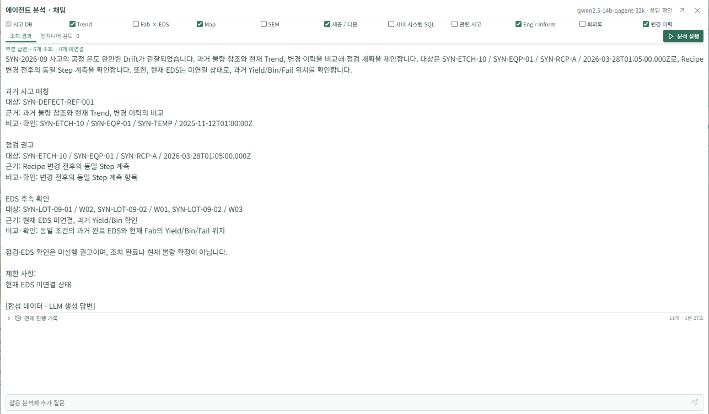

# LLM 점검 계획 실행 예시

## 실행 범위

- 실행: 2026-09-22 10:20:12~10:21:39 KST, Skill release `quality-demo-0.48`.
- 후속 `0.49`는 일반 답변의 nullable 계획 키를 JSON Schema 필수 키에 포함한 호환성 수정이다. 이 실행에서 사용한 점검 요청의 출력 계약은 동일하다.
- 모델: 로컬 Ollama `qwen2.5-14b-qagent-32k`.
- 대상: `SYN-2026-09`, `SYN-ETCH-10 / SYN-EQP-01 / SYN-TEMP`. 합성 자료의 기준일은 2026-03-31이다.
- 선택 자료: 사고 DB, Trend, Map의 저장된 과거 참조, 생산, Inform, 변경 이력.
- 실행 결과: `partial`, LLM 4회, Tool 2회, 약 87초. 재조회 없이 Router 2회, Judge, Answer로 완료했다. 이는 단일 실행 기록이며 속도나 정확도 벤치마크가 아니다.

질문은 과거 불량 참조와 현재 Trend·변경 이력으로 점검 계획을 만들고, 미연결 EDS는 결과 판정 대신 향후 확인 계획을 제안하라는 내용이었다.

## 실제 출력

아래는 실제 모델 답변의 요지다. 고정 답변을 대신 표시하지 않았다.

| 구분 | 생성된 내용 |
|---|---|
| 과거 참조 | `SYN-DEFECT-REF-001`, `SYN-ETCH-10 / SYN-EQP-01 / SYN-TEMP`, 2025-11-12T01:00:00Z |
| 현재 점검 | `SYN-RCP-A`의 2026-03-28T01:05:00Z 변경 전후 동일 Step 계측 비교 |
| EDS 대상 | `SYN-LOT-09-01 / W02`, `SYN-LOT-09-02 / W01`, `SYN-LOT-09-02 / W03` |
| EDS 확인 | 결과 수신 후 Yield·Bin·Fail 위치를 조건이 맞는 과거 완료 EDS와 비교 |
| 판정 경계 | 미실행 권고이며 현재 불량 확정이나 조치 완료가 아님 |

사고 DB를 먼저 조회해 scope를 확인한 뒤 `get_engineering_snapshot`으로 자료를 읽었다. 과거 참조는 Step/Item/설비 및 Inform·계측 기록의 저장 관계를 확인한 것이다. 이 실행은 관련 사고 SQL 검색이나 이미지 유사도 모델이 새로 사고를 찾아냈다는 증거가 아니다.

## 구현과 검증

Answer의 `inspection_plan`은 `historical_matches`, `checks`, `eds_followup`으로 구성한다. 조회된 과거 참조가 있으면 비교 항목이 필수이며, 참조 ID와 Tool 근거 ID를 코드에서 검증한다. 점검은 최대 3개이고, 빈 필드·누락된 계획·없는 참조는 완료 답변으로 저장하지 않는다. Workbench는 검증된 계획을 구분해 표시한다.

이전 로컬 실행에서는 불필요한 재조회, 계획 누락, 현재 DOWN/PM 로그를 과거 로그와 동일하다고 과장하는 오류가 있었다. 역할별 Skill과 출력 계약을 보완했으며, 실패한 답변을 성공 화면으로 공개하지 않았다.

검증: Python 263개 테스트, Web 167개 테스트, Web 빌드, 실제 브라우저 표시 확인. 테스트 수는 형식·범위·조회 계약의 확인이며 모델의 의미 정확도 점수가 아니다.

## 남은 한계

- 현재 EDS Adapter는 미구현이다. 실제 결과 수신·자동 재검증·생산 조치는 수행하지 않았다.
- 이번 실행에는 새 SEM/Overlay 모델 비교, 회의록, 사내 시스템 SQL을 포함하지 않았다. 화면의 과거 참조와 새 이미지 비교를 혼동하지 않는다.
- Recipe·제품·검사 조건 및 Bin 정의가 과거와 동일한지는 추가 확인 대상이다. 같은 조건임이 이미 검증됐다는 뜻이 아니다.
- 단일 합성 사례에서 기본 점검 계획이 생성된 것만 확인했다. 전체 자료 조합과 다른 질문에서의 안정성, 더 구체적인 계측·허용 기준 제안, 사내 전문가 검증은 남아 있다.
- Judge는 Answer 이전의 근거 충분성을 검토한다. 근거 ID가 유효해도 최종 서술의 모든 의미가 정확하다는 보장은 없으므로 현장 판단 전 원문 대조가 필요하다.

전체 로그와 대화 DB, 로컬 모델 설정은 `var/`와 `*.local.yaml`에 보관하며 Git에는 올리지 않는다.

## 첫 화면 분석 보고서

2026-09-22 11:48:12 KST에 완료한 후속 Qwen 실행은 사고 DB, Trend, Map 참조, SEM, Inform, 변경 이력을 사용했다. LLM 6회와 Tool 6회로 `partial` 답변을 생성했다. 조회된 온도 평균은 변동 전 65.044573°C, 이후 65.085173°C, 차이는 0.0406°C다. 이는 규격 이탈이나 불량 확정 수치가 아니다.

기본 주소는 저장된 분석 메시지에 연결된 보고서를 표시한다. 근거 이미지는 실제 SEM Tool이 비교한 자산과 Snapshot에서 반환한 과거 참조에 한정한다. 비교 이미지 `SYN-LOT-09-01 / W01`은 설비 `SYN-EQP-02`, 선택 범위의 `W02`는 `SYN-EQP-01`로 서로 다르다. 합성 분류기 관찰과 정량 이미지 정합은 별개이며, 이 실행의 SEM 비교 상태는 `INCOMPARABLE`이다.

첫 시도에서는 DOWN 시작 시각을 Trend 시작과 혼동했고, 같은 대화에서 재요청한 시도는 Router 출력 한도에 도달했다. 게시한 최종 보고서는 생산 자료를 제외한 새 실행이며 DOWN 시간과 불량 확률을 주장하지 않는다. 모델의 시간 추론 문제가 일반적으로 해결됐다는 증거는 아니다.

Python 267개·Web 167개 테스트와 빌드를 통과했다. 브라우저에서 첫 접속·재접속의 GET-only 로딩, 근거 이미지 로딩, 모바일 너비와 이미지 확대를 확인했다. 대화 DB와 전체 모델 결과는 공개하지 않는다.
