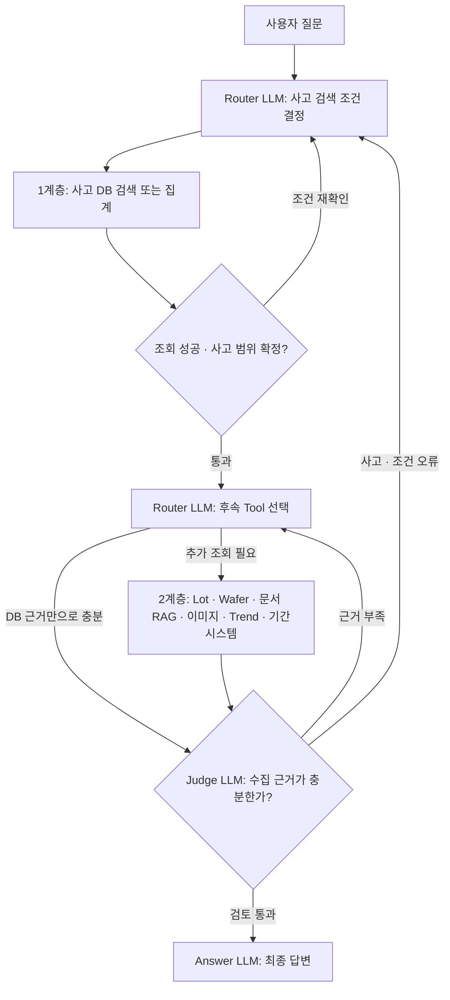

# LLM 배치와 실제 데이터 확인 원칙

## 1. 논리 배치: 세 역할의 호출 위치

이 그림은 목표 Orchestrator 동작이다. 현재 실행 코드는 설정 검증, Skill 조합, SQLite Tool/더미 검증까지이며 실제 LLM 호출과 아래 전체 루프는 아직 연결되지 않았다.

**주 흐름은 사용자 질문부터 최종 답변까지 위에서 아래로 내려간다. 사고 DB와 후속 Tool은 같은 계층이 아니다.** 1계층에서 조회 성공과 대상 범위를 확인한 뒤에만 2계층 Tool 사용을 허용한다. 이 통과 조건은 코드가 검사한다. 사고 DB 조회만으로 답할 수 있으면 2계층에서 추가 Tool 실행을 생략할 수 있다.

그림의 Router 두 상자는 **같은 Router 역할을 서로 다른 단계에서 호출**한다는 의미다. 첫 호출은 사고 DB 조건만 결정한다. DB 통과 후 호출은 그 결과와 확정된 범위를 사용해 필요한 다른 Tool을 선택한다. 초기 호출에서 후속 업무 Tool을 실행 가능한 계획으로 내보내지 않는다.

| 돌아오는 이유 | 돌아가는 위치 | 유지/재확인할 내용 |
|---|---|---|
| DB 조회 실패 또는 사고 후보 미확정 | 1계층 Router | 조건/사고 선택을 확인. 접근권한 오류는 우회하지 않고 제한 표시 |
| Judge가 같은 사고의 근거 부족 판정 | 2계층 Router | 유효한 사고 범위 유지, 부족한 근거만 추가 조회 |
| Judge가 잘못된 사고/조건 판정 또는 범위 만료 | 1계층 Router | 기존 범위를 재사용하지 않고 사고 DB부터 재확인 |
| Judge 검토 통과 | 맨 아래 Answer | 검토된 근거와 판정으로 최종 답변 작성 |
| 확인 불가 또는 재조회 예산 소진 | 맨 아래 Answer | abstain 판정에 따라 확인된 사실과 미해결 항목만 설명 |

되돌아가는 화살표는 재조회 경로다. code가 현재 scope의 사용자/권한/만료와 오류 상태를 확인한 뒤 다음 단계를 결정한다. Judge 출력 자체가 직접 Tool을 호출하거나 gate를 해제하지 않는다. 반복 예산을 소진하면 확인된 결과와 미해결 항목을 표시하고 종료한다.

LLM이 DB를 직접 실행하는 것이 아니다. Router가 구조화된 계획을 내고 코드가 허용 Tool, 필터, 선조회, 선택 scope를 확인한 뒤 Adapter를 실행한다. 코드 검사 실패를 Judge pass로 덮어쓸 수 없다. 재조회는 설정된 호출 예산 안에서만 진행하고 초과 시 미확인 상태를 표시하는 것이 목표다. 현재 `runtime`의 전체 Orchestrator 예산 집행은 미구현이다.

| 역할 | 받는 입력 | 출력 | 연결 Skill |
|---|---|---|---|
| Router | 원문 질문, 현재 사고 범위, 이전 Tool 결과, 필요한 사전/Schema | 의도, 논리 필터, Tool 계획, 추가 확인 요청 | quality-router + core + 관련 Schema/조회 절차/용어 |
| Judge | 원문 질문, Router 계획, 사고 범위, Tool 근거, 코드 검사 결과 | pass/revise/need_evidence/abstain와 근거 문제 항목 | quality-judge + core + 해당 검증 규칙 |
| Answer | 원문 질문, 선택 사고, Judge 판정, 검토된 Tool 결과와 근거 ID | 주장과 근거가 연결된 최종 답변 | quality-answer + core + 관련 Schema/통계/문서 근거 |

Judge는 Answer 호출 전에 실제 Tool 근거가 질문에 답하기에 충분한지 검토한다. Answer는 이 검토 뒤 최종 답변을 작성하는 마지막 LLM이다. 같은 모델의 자기 검토가 독립된 정답을 보장하지 않으므로 수량, ID, 관계, 페이지 완전성은 코드로 별도 확인한다. 역할 간 공유하는 것은 조사 상태/근거/Skill 소스이며 내부 추론 텍스트를 공유할 필요는 없다.

## 2. 물리 배치: 모델 서버와 역할은 별개

현재 저장소 기본 config의 실제 선언은 다음과 같다. 모델 서버의 존재나 가동 상태를 확인한 값이 아니다.

| 역할 | config의 모델 참조 | API 예시 | 생성 설정 |
|---|---|---|---|
| Router | roles.router.model = text | models.text의 같은 endpoint | temperature 0, 출력 상한 1,200 |
| Answer | roles.answer.model = text | models.text의 같은 endpoint | temperature 0, 출력 상한 3,000 |
| Judge | roles.judge.model = text | models.text의 같은 endpoint | temperature 0, 출력 상한 1,200 |

`models.text.enabled=false`, `served_model=SET_SERVED_MODEL_NAME`이고 API 주소 `http://127.0.0.1:8000/v1`은 설정 예시다. 모델 서버가 배치됐다고 보고하지 않는다. 현재 세 역할은 하나의 text 모델 설정을 참조하며 서로 다른 Skill로 만든 system prompt를 각각 전달하도록 설계돼 있다. 역할이 세 개라고 모델 가중치를 세 벌 로딩하거나 GPU 세 장을 요구하는 구조는 아니다.

사내에서 역할별 모델을 다르게 쓰려면 models에 별도 모델 설정을 추가하고 roles의 model 참조를 변경한다. 같은 endpoint의 model alias 변경과 다른 endpoint로의 변경을 구분한다. 구체 GPU/VM 배치는 실제 가용 자원과 부하 측정 후 deployment 설정에 연결하며, 기존 GPU 신청/산정 문서는 이번 문서에서 변경하지 않는다.

사내문서/Eng’r Inform Note 검색의 embedding/reranker는 기존 검색 서비스의 구성이다. Router/Answer/Judge 세 역할과 구분하며, 현재 source_managed 설정이므로 실제 검색 서비스의 모델·인덱스 버전을 사내에서 확인해야 한다.

## 3. 실제 사고 질문의 호출 예

질문: “외곽 Shot 사고의 Lot와 Wafer 목록, 조치 근거를 보여줘.”

1. Router가 사고명 검색 + Lot/Wafer 목록 + 문서 근거 의도를 반환한다.
2. 코드가 사고 DB 검색을 먼저 실행한다. 사고명이 여러 건이면 선택을 요청하고 범위를 확정한다.
3. 확정된 scope에서 Lot → Wafer Tool을 실행한다. 사고문서 검색은 필요한 연결 조건이 확보되면 목록 조회와 독립적으로 실행할 수 있다.
4. 추가 근거가 필요한 경우 Router에 현재 결과를 다시 주고 필요한 Tool만 계획하게 한다. 미확인 사고명을 다른 사고의 문서에 연결하지 않는다.
5. Judge가 질문과 Tool 근거를 대조한다. Wafer 페이지나 조치 근거가 부족하면 Router로 되돌려 필요한 Tool을 재조회한다.
6. Judge 검토를 통과하면 Answer가 최종 답변을 작성한다. 목록 데이터는 Tool 결과를 사용하고 전체/현재 페이지 범위를 표시한다.
7. 출력 형식과 근거 ID 등은 코드로 검사해 표시한다. Answer 뒤에 다른 LLM을 호출하지 않는다.

## 4. 모든 Skill의 실제 데이터 확인 규칙

18개 SKILL.md 모두에 다음 규칙을 직접 명시했다.

> 수정 전 관련 실제 원본과 대표 데이터를 확인하고 출처, 기준시점, 변경 근거를 기록한다. 실제 데이터에 접근할 수 없으면 미확인으로 표시하고 설계/더미 초안으로만 관리한다. 더미 검증을 실제 데이터 검증으로 주장하거나 확인 없이 컬럼 의미, 관계, 코드값을 확정하지 않는다. 이 규칙은 원본 데이터 수정이나 온라인 Skill 자기 수정 권한을 부여하지 않는다.

이는 수정 시 검증 원칙이다. 일반 질문마다 전체 DB를 스캔하라는 뜻이 아니며, 사내 접근이 없는 개발 단계에서는 명확히 표시한 초안과 합성 회귀 검증을 진행할 수 있다. 실제 원장의 컬럼/관계/코드 의미를 확정하는 단계에서는 해당 실제 자료를 확인해야 한다.

| 수정 대상 | 확인할 실제 자료 |
|---|---|
| Schema Skill / 컬럼 매핑 | DDL, 컬럼 설명, 권한 내 대표 행, NULL 분포, 키 중복, 실제 관계 |
| 동의어 | 공식 조직/공정 코드와 적용 범위, 실제 사용자 표기, 유효기간 |
| Lot/Wafer 조회 | 같은 사고의 원장 수량과 연결 행, 중복/누락, 사고 영향/전체 구성 구분 |
| 통계 | 기준 SQL 결과, 집계 단위와 모집단, 분모, 날짜/시간대 |
| 문서/RAG | 기존 chunk 응답, 문서 ID/버전/위치, 연결 사고, 적용된 검색 필터 |
| 이미지/Trend | 원본 메타데이터, 좌표/시간/단위, 모델/룰 결과와 검증 사례 |
| 역할 프롬프트 | 실제 실패 질문, 해당 Tool 근거, 기존/수정 답변, 변경에 쓰지 않은 평가 사례 |
| 조치 | 실제 상태/대상, 승인 이력, 시스템 계약과 검증된 실행 결과 |

확인 기록에는 변경 범위, 자료 참조, 확인시각, 데이터 기준시점, 관찰한 문제, 수정 내용, 검증 결과와 미확인 항목을 남긴다. 사내 원문/식별자/접속정보를 이 GitHub 예제에 복사할 필요는 없으며 사내 승인 환경의 증거 참조로 관리한다.

현재 확인한 자료는 저장소 소스/config와 생성된 합성 SQLite/문서/SVG/Trend이다. 사내 실제 DB, 원문 저장소, 운영 LLM 응답에는 접근하지 않았으므로 실제 데이터 검증 완료로 표시하지 않는다.

## 배치 수정 기록 — 2026-09-13

사용자가 지정한 Router → Tool → Judge → Answer 순서를 기준으로 기존 소스와 역할 계약을 대조해 수정했다. Judge는 답변 작성 전 근거를 검토하고 Answer가 최종 작성한다. 사내 실제 데이터와 운영 LLM 응답은 미확인이며 이번 변경은 설계 및 Skill 소스 수정이다.
